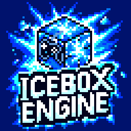

<p align="center">
  
</p>

<h1 align="center">🧊 IceBox Engine™</h1>

<p align="center">
  <strong>🇬🇧 English</strong> &nbsp;•&nbsp; <a href="README.ru.md">🇷🇺 Русский</a>
</p>

<p align="center">
  <strong>A powerful, modular 2D game engine built with modern C++ and open-source libraries</strong>
</p>

<p align="center">
  
  
  
  
</p>

<p align="center">
  
  
</p>

---

## 🧊 About

IceBox Engine is a cross-platform 2D game engine designed for creating games of any visual style — from simple pixel-art projects to high-resolution 4K HD 2D games with rich visual effects. The engine includes a full-featured visual editor, a project launcher, an automatic updater, and a lightweight runtime for shipping finished games to players.

**Scripting:**
- **Lua** — game scripting language for gameplay logic, UI, AI, and more
- **Python** — engine-side scripting for editor tools and automation

---

## ✨ Features

- **Rendering** — Data-driven 2D renderer with a node-based **material editor** (instances & functions), post-processing / **FX**, and a multi-backend RHI: OpenGL 4.6, OpenGL ES, Vulkan, Metal (via ANGLE & MoltenVK), WebGL 2, and WebGPU.
- **Scenes & ECS** — Entity-Component-System core (EnTT), level outliner, reusable entity classes, and a property/world editor.
- **2D Physics** — Rigid bodies, colliders, and joints powered by Box2D.
- **Sprites & Tilemaps** — Sprite editor, spritesheet slicer, flipbook animation, and dedicated tilemap / tileset editors.
- **Animation** — Skeletal animation, flipbooks, and timeline-driven clips.
- **Text & UI** — In-engine UI widgets and high-quality text via FreeType, HarfBuzz, and FriBidi (full Unicode shaping with right-to-left support).
- **Audio** — Mixing and playback with Opus / Vorbis codec support.
- **Scripting** — Lua gameplay scripting with an integrated debugger, a **visual node-graph** editor, and Python for editor tooling.
- **AI** — Pathfinding, behaviour trees, and navigation.
- **Networking** — Reliable UDP (ENet) plus WebSocket transport (IXWebSocket) for browser/server play, with cryptography via libsodium.
- **Video** — Video playback and a cinematic / cutscene editor (FFmpeg).
- **Localization** — 14 built-in languages with right-to-left support, editable from the localization panel.
- **Extensibility** — Drop-in **plugin** system and **mod** support.
- **Tooling** — Built-in Tracy profiler, stats overlays, a hot-key editor, and a one-click **Build Game** pipeline targeting every supported platform.

---

## 🎮 Platform Support

| Platform | Development | Runtime |
|----------|:-----------:|:-------:|
| **Windows** | ✅ | ✅ |
| **Linux** | ✅ | ✅ |
| **macOS** | ✅ | ✅ |
| **iOS** | ❌ | ✅ |
| **Android** | ❌ | ✅ |
| **Web** | ❌ | ✅ |

---

## 🏗️ Architecture

IceBox Engine consists of several components:

| Component | Binary | Description |
|-----------|--------|-------------|
| **Launcher** | `IceBoxLauncher` | Entry point for users. Manages projects (create, open, delete), checks for engine updates, and launches the editor for the selected project. |
| **Editor** | `IceBoxEngine` | The main visual editor. Scene editing, asset management, tilemap editor, animation tools, scripting workspace, and game build pipeline (Tools → Build Game). |
| **Updater** | `IceBoxUpdater` | Background update service. Downloads and applies engine patches automatically. |
| **Runtime** | `IceBoxRuntime` | Lightweight, editor-free executable shipped with built games. Runs the game project directly on the target platform. |

---

## 🚧 Project Status

**IceBox Engine is under active development.** Core systems, editor tools, and architecture are evolving continuously with new features and improvements.

---

## 💻 System Requirements

### Engine & Editor (Desktop)

| | |
|-|-|
| **OS** | Windows 7+ (x64/x86), Linux Debian/Ubuntu (x64/x86), or macOS 11.0+ (Apple Silicon or Intel) |
| **CPU** | Dual-core processor |
| **RAM** | 4 GB |
| **GPU** | OpenGL 3.3/4.6 or Vulkan 1.1-1.4 compatible (Windows / Linux) or Metal-capable GPU (macOS, via ANGLE or MoltenVK), 512 MB VRAM |
| **Disk** | 5–10 GB free space |

### Runtime — iOS

| | |
|-|-|
| **OS** | iOS 14.0+ (iPhone & iPad, arm64) |
| **GPU** | Metal (rendered via MoltenVK) |

### Runtime — Android

| | |
|-|-|
| **OS** | Android 7.0+ (API 24) |
| **GPU** | OpenGL ES 3.2/3.0 or Vulkan 1.1-1.4|

### Runtime — Web

| | |
|-|-|
| **Browser** | Any modern browser with WebGL 2.0 or WebGPU support |

---

## 📦 Build Requirements

### To build games (Tools → Build Game)

| Target platform | Additional requirements |
|-----------------|----------------------|
| 🪟 **Windows** | *(nothing extra — same tools as above)* |
| 🐧 **Linux** | WSL2 (if building from Windows) or native GCC/Clang + Ninja |
| 🍎 **macOS** | macOS host with Xcode 15+ Command Line Tools, vcpkg with `arm64-osx` / `x64-osx` triplets |
| 📱 **iOS** | macOS host with Xcode 15+ (full IDE, not just CLI tools), vcpkg with `arm64-ios` triplet, Apple Developer account for device deployment |
| 🤖 **Android** | Android SDK 36+, NDK 29+, Java JDK 25+, Gradle 9.4.0 *(auto-downloaded)* |
| 🌐 **Web** | [Emscripten SDK](https://emscripten.org/) |

---

## ⚙️ Quick Setup

### Windows

```bash
# Install vcpkg
git clone https://github.com/microsoft/vcpkg C:\dev\vcpkg
C:\dev\vcpkg\bootstrap-vcpkg.bat
set VCPKG_ROOT=C:\dev\vcpkg
```

### Linux / WSL2

```bash
# 1. Install all system dependencies (one command)
sudo apt update && sudo apt install -y \
    build-essential cmake ninja-build git curl zip unzip tar pkg-config nasm xdg-utils \
    autoconf autoconf-archive automake libtool \
    python3-dev python3-venv \
    rsync gdb nsis imagemagick \
    libx11-dev libxft-dev libxext-dev libxrandr-dev libxcursor-dev libxi-dev libxfixes-dev libxss-dev libxtst-dev \
    libxkbcommon-dev libwayland-dev wayland-protocols libdecor-0-dev \
    libibus-1.0-dev \
    libgl1-mesa-dev libegl1-mesa-dev libgles2-mesa-dev \
    libasound2-dev libpulse-dev \
    libdbus-1-dev \
    libssl-dev zenity libespeak-ng-dev \
    mingw-w64 g++-mingw-w64

# 2. Install vcpkg
git clone https://github.com/microsoft/vcpkg ~/vcpkg
~/vcpkg/bootstrap-vcpkg.sh
echo 'export VCPKG_ROOT=~/vcpkg' >> ~/.bashrc && source ~/.bashrc
```

### macOS / iOS build tools (Apple host required)

> **Note:** macOS and iOS targets must be built **on a macOS host**. Windows / Linux machines cannot cross-compile to Apple platforms because Apple's SDKs (Metal, UIKit, Cocoa) and `xcodebuild` are macOS-only.

```bash
# 1. Install Xcode (full IDE from the Mac App Store) and accept the license
sudo xcodebuild -license accept

# 2. Install command-line dependencies (Homebrew recommended)
brew install cmake ninja git

# 3. Install vcpkg
git clone https://github.com/microsoft/vcpkg ~/vcpkg
~/vcpkg/bootstrap-vcpkg.sh
echo 'export VCPKG_ROOT=~/vcpkg' >> ~/.zshrc && source ~/.zshrc
```

### Android build tools (Windows)

```bash
# 1. Install Android SDK + NDK 29 via Android Studio or command-line tools
# 2. Install Java JDK 25+
# 3. Set environment variables:
set ANDROID_HOME=C:\Users\%USERNAME%\AppData\Local\Android\Sdk
set ANDROID_NDK_ROOT=%ANDROID_HOME%\ndk\29.0.14206865
set JAVA_HOME=C:\Program Files\Java\jdk-25

# Gradle 9.4.0 is downloaded automatically by the build script if not installed.
```

### Android build tools (Linux / WSL2)

```bash
# 1. Install Java JDK 25+
sudo apt update && sudo apt install -y openjdk-25-jdk
export JAVA_HOME=/usr/lib/jvm/java-25-openjdk-amd64

# 2. Install Android SDK command-line tools
mkdir -p ~/Android/Sdk/cmdline-tools
cd ~/Android/Sdk/cmdline-tools
curl -fL -o tools.zip https://dl.google.com/android/repository/commandlinetools-linux-14742923_latest.zip
unzip -q tools.zip && rm -rf latest && mv cmdline-tools latest && rm tools.zip

# 3. Install SDK components & NDK 29
export ANDROID_HOME=~/Android/Sdk
export PATH=$PATH:$ANDROID_HOME/cmdline-tools/latest/bin
yes | sdkmanager --licenses
sdkmanager "platform-tools" "platforms;android-36" "build-tools;36.0.0" "ndk;29.0.14206865"
export ANDROID_NDK_ROOT=$ANDROID_HOME/ndk/29.0.14206865

# Gradle 9.4.0 is downloaded automatically by the build script if not installed.

# 4. (Optional) Persist environment variables
echo 'export JAVA_HOME=/usr/lib/jvm/java-25-openjdk-amd64' >> ~/.bashrc
echo 'export ANDROID_HOME=~/Android/Sdk' >> ~/.bashrc
echo 'export ANDROID_NDK_ROOT=$ANDROID_HOME/ndk/29.0.14206865' >> ~/.bashrc
source ~/.bashrc
```

### Web build tools (Windows)

```bash
# Install Emscripten SDK
git clone https://github.com/emscripten-core/emsdk.git C:\dev\emsdk
cd C:\dev\emsdk
.\emsdk install latest
.\emsdk activate latest
```

### Web build tools (Linux / WSL2)

```bash
# 1. Install Emscripten SDK
git clone https://github.com/emscripten-core/emsdk.git ~/emsdk
cd ~/emsdk
./emsdk install latest
./emsdk activate latest
source ./emsdk_env.sh

# 2. (Optional) Persist environment
echo 'source ~/emsdk/emsdk_env.sh' >> ~/.bashrc
```

---

## 📚 Third-Party Libraries

IceBox Engine uses a number of open-source third-party libraries, each distributed under its own license (MIT, zlib, BSD-3-Clause, Apache-2.0, ISC, FreeType/FTL, SIL OFL for the bundled fonts, and LGPL-2.1 for FFmpeg and GNU FriBidi, which are dynamically linked so they can be replaced freely).

Full list of libraries and their licenses: **[THIRD_PARTY_NOTICES.txt](THIRD_PARTY_NOTICES.txt)**

---

## 📬 Contact

| | |
|-|-|
| 🌐 **Website** | [www.ice-box-crew.com](https://www.ice-box-crew.com/) |
| 📧 **Email** | [iceboxcrew057@gmail.com](mailto:iceboxcrew057@gmail.com) |
| 🐛 **Issues** | [GitHub Issues](https://github.com/IceBoxCrew/IceBoxEngine/issues) |

---

## 📄 License

**IceBox Engine** is proprietary software.  
All rights reserved by **IceBoxCrew Studio** © 2026.

See [LICENSE.txt](LICENSE.txt) for details.

---

<p align="center">
  <strong>Built with ❄️ by IceBoxCrew Studio</strong>
</p>
