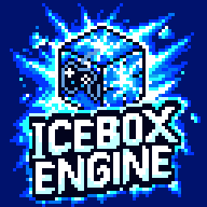

<p align="center">
  
</p>

<h1 align="center">🧊 IceBox Engine™</h1>

<p align="center">
  <a href="README.md">🇬🇧 English</a> &nbsp;•&nbsp; <strong>🇷🇺 Русский</strong>
</p>

<p align="center">
  <strong>Мощный модульный 2D игровой движок на современном C++ и open-source библиотеках</strong>
</p>

<p align="center">
  
  
  
  
</p>

<p align="center">
  
  
</p>

---

## 🧊 О движке

IceBox Engine — это кроссплатформенный 2D игровой движок, предназначенный для создания игр в любом визуальном стиле — от простых проектов в пиксель-арте до 2D-игр с разрешением 4K HD и богатыми визуальными эффектами. Движок включает полнофункциональный визуальный редактор, лаунчер проектов, автоматический апдейтер и легковесный рантайм для поставки готовых игр игрокам.

**Скриптинг:**
- **Lua** — игровой скриптовый язык для игровых классов, UI, уровней и многого другого
- **Python** — скриптинг на стороне движка для инструментов редактора и автоматизации

---

## ✨ Возможности

- **Рендеринг** — Data-driven 2D-рендерер на **графе рендеринга**, пакующий тысячи спрайтов в один вызов отрисовки с GPU-отсечением и инстансингом, нодовый **редактор материалов** (инстансы, функции и общие коллекции параметров), **декали** (дырки от пуль, брызги крови, следы копоти), immediate-mode API отрисовки для процедурной геометрии и мультибэкендовый RHI: OpenGL 3.3/4.6, OpenGL ES 3.0/3.2, Vulkan 1.1-1.4, Direct3D 12, нативный Metal (плюс Metal через ANGLE и MoltenVK), WebGL 2.0 и WebGPU.
- **Свет и тени** — Точечные, конусные и направленные источники света с текстурными **масками**, 2D-тени в реальном времени по коллайдерам или по обведённому контуру самой графики и опциональная аппаратная **трассировка глобального освещения**.
- **Пост-обработка** — Bloom, тонмаппинг ACES, глубина резкости, SSAO, SSR, объёмный туман, цветокоррекция и другое, смешиваемое из **объёмов пост-обработки**, расставленных на уровне.
- **Частицы и FX** — Стековые эмиттеры (Spawn / Initialize / Update / Render) на редактируемых кривых и градиентах, симуляция **на CPU или GPU**, силы от curl-шума до вихрей, **SPH-жидкости**, светящиеся частицы и ленты-трейлы.
- **Качество картинки** — FXAA / MSAA / SSAA, масштаб рендера 1-200%, апскейл **FSR** и **NIS** с пресетами качества, вывод **HDR10**, VSync, режим низкой задержки и **адаптивное качество**, которое само удерживает целевой FPS — и всё это переключается прямо в рантайме, так что игровое меню настроек пишется в несколько строк на Lua.
- **Сцены и ECS** — Ядро на основе Entity-Component-System (EnTT), аутлайнер уровней, переиспользуемые классы сущностей с наследованием, редактор свойств/мира, гизмо трансформа с рамочным выделением и привязкой к сетке, ортографические камеры со сглаженным следованием, тряской, наклоном и границами и **асинхронная загрузка уровней** с прогрессом для экранов загрузки.
- **2D-физика** — Твёрдые тела, коллайдеры и сочленения на базе Box2D с многопоточным решателем (enkiTS) на десктопе и мобильных, платформы с проходом снизу, рэгдоллы и физика костей, лучи и свипы окружностью / боксом / капсулой, коллизии прямо из спрайтов, флипбуков и тайлмапов и **разрушение** на настоящие физические осколки.
- **Спрайты и тайлмапы** — Редактор спрайтов, слайсер спрайт-листов, флипбук-анимация и отдельные редакторы тайлмапов / тайлсетов с **ортогональной, изометрической и гексагональной** проекциями, поворотными многоклеточными и анимированными тайлами.
- **Анимация** — Скелетная анимация с IK, скинами, деформируемыми мешами и физикой костей, флипбуки, стейт-машины анимации и клипы по таймлайну.
- **Текст и UI** — Внутренние UI-виджеты (19 типов элементов, якоря и растягивающиеся раскладки, nine-slice, анимация по ключевым кадрам, навигация геймпадом) и высококачественный текст через FreeType, HarfBuzz и SheenBidi (полный Unicode-шейпинг с поддержкой письма справа налево).
- **Доступность** — Режимы для дальтоников, шрифт для дислексии, **синтез речи** для наведённых и сфокусированных элементов, линза поля зрения, скорость игры и принудительный моно-звук — всё это читается игрой, поэтому выпущенная сборка уважает выбор игрока.
- **Аудио** — Пространственное микширование и воспроизведение (miniaudio) с фильтрами, эквалайзером, задержкой и ревербом на каждый источник, шестью группами микшера, несколькими слушателями, потоковой музыкой и поддержкой кодеков Opus / Vorbis.
- **Голос** — Захват микрофона, кодирование и декодирование Opus, анализ громкости в реальном времени и запись в WAV — доступно и одиночным играм, не только сетевым.
- **Видео** — Воспроизведение видео прямо в текстуру и редактор кат-сцен / кинематографики (FFmpeg).
- **Ввод** — Клавиатура, мышь, четыре геймпада с вибрацией и датчиками движения, восемь сырых джойстиков, тач на десять пальцев со щипком и свайпом, перо/стилус, силовая отдача (**haptics**) и датчики устройства — всё через SDL3.
- **Скриптинг** — Игровой скриптинг на Lua со встроенным отладчиком, **визуальный нодовый** редактор и Python для инструментов редактора.
- **Геймплейные системы** — Пулы объектов, волны врагов, кулдауны, достижения, твины, конечные автоматы, таймеры, корутины, шина событий, типизированные коллекции (перечисления, массивы, словари, множества, структуры, таблицы данных), самосохраняющиеся таблицы и сидированный рандом плюс **шумы** Перлина, симплекс, fBm, ridged, Вороного и curl с искажением области — чтобы процедурный мир каждый раз генерировался одинаково.
- **Сохранения и реплеи** — Состояние игры, переживающее смену уровня, бинарные **снимки сцены** (физические тела, аниматоры, скелеты и кости рэгдоллов) для чекпоинтов и быстрых сохранений, слоты сохранений на диске и запись **реплеев** с кольцевым буфером для killcam.
- **ИИ** — Деревья поведения с блэкбордами, сервисами и **EQS**, восприятие зрением, **сетки навигации** A\* с линией видимости и полями потока и система **тумана войны**.
- **Сеть** — Надёжный UDP (ENet) плюс WebSocket-транспорт (IXWebSocket) для игры в браузере/через сервер, с автоматической репликацией, дельта-сжатием, зоной интереса, предсказанием, компенсацией лагов, **rollback-неткодом**, голосовым чатом, поиском серверов, подбором игроков, headless-серверами и криптографией через libsodium.
- **Локальный мультиплеер** — Сплит-скрин до четырёх игроков, у каждого своя камера, UI, слушатель звука и устройство ввода.
- **Сервисы платформ** — Реклама, внутриигровые покупки, Play Games / Game Center, облачные сохранения, аналитика, уведомления, GDPR-согласие, оценка приложения, диплинки, разрешения, Bluetooth и Web3 — мосты под каждую платформу, доступные из Lua.
- **Ассеты** — 25 типов ассетов, у каждого свой редактор, скрытые сайдкары с настройками импорта, редиректоры, просмотр ссылок, массовое редактирование, импорт из Aseprite и GIF и **подготовка ассетов** (WebP / KTX2 / Opus / Vorbis / VP9 / сабсеттинг шрифтов) с защитой от потерь, которая не трогает чёткий пиксель-арт.
- **Локализация** — 14 встроенных языков редактора с поддержкой письма справа налево и игровая локализация редактируемая из панели локализации.
- **Расширяемость** — Drop-in система **плагинов** и поддержка **модов**, вместе с **Plugin Builder**, который собирает нативные плагины отдельно, без сборки движка.
- **Сборка** — **Build Game** в один клик под все шесть платформ: подготовленный контент в сжатых zstd архивах `IcePak` за виртуальной файловой системой, манифесты с SHA-256, NSIS `.exe` и WiX `.msi`, `.deb` и `.AppImage`, macOS `.dmg` / `.pkg` с подписью кода и опциональной нотаризацией, Android `.apk` / `.aab`, iOS `.ipa`, DLC-паки, монтирующиеся поверх базовой игры, и headless-серверы.
- **Инструментарий** — Встроенный профилировщик Tracy, профайлер кадра с записью трейсов, GPU-таймингами по проходам, учётом памяти и VRAM и детектором фризов, **23 отладочных оверлея** (коллайдеры, сетки навигации, тепловые карты света, грани теней, Z-глубина, заморозка отсечения и другое), оверлеи статистики, консоль разработчика с командами и переменными (CVar), краш-репортер, который отправляет отчёты только на настроенный вами адрес, **Remote Preview** на Android-устройство по USB и справочник горячих клавиш.

---

## 🎮 Поддержка платформ

| Платформа | Разработка | Runtime |
|----------|:-----------:|:-------:|
| **Windows** | ✅ | ✅ |
| **Linux** | ✅ | ✅ |
| **macOS** | ✅ | ✅ |
| **iOS** | ❌ | ✅ |
| **Android** | ❌ | ✅ |
| **Web** | ❌ | ✅ |

---

## 🏗️ Архитектура

IceBox Engine состоит из нескольких компонентов:

| Компонент | Бинарник | Описание |
|-----------|--------|-------------|
| **Launcher** | `IceBoxLauncher` | Точка входа для пользователей. Управляет проектами (создание, открытие, удаление), проверяет обновления движка и запускает редактор для выбранного проекта. |
| **Editor** | `IceBoxEngine` | Основной визуальный редактор. Редактирование сцен, управление ассетами, редактор тайлмапов, инструменты анимации, рабочая область для скриптинга и пайплайн сборки игры (Tools → Build Game). |
| **Updater** | `IceBoxUpdater` | Отдельное приложение обновления. Проверяет манифест обновлений, затем скачивает, проверяет и устанавливает новую версию движка — всегда по вашему явному подтверждению, никогда молча — и после установки открывается снова, чтобы сообщить результат. |
| **Runtime** | `IceBoxRuntime` | Легковесный исполняемый файл без редактора, поставляемый со собранными играми. Запускает игровой проект напрямую на целевой платформе. |

---

## 🚧 Статус проекта

**IceBox Engine находится в активной разработке.** Основные системы, инструменты редактора и архитектура непрерывно развиваются вместе с новыми функциями и улучшениями.

---

## 💻 Системные требования

### Движок и редактор (десктоп)

| | |
|-|-|
| **ОС** | Windows 10+ (x64/x86/arm64), Linux — Ubuntu 22.04+ / Debian 12+ (x64/x86/arm64) или macOS 11.0+ (Apple Silicon или Intel) |
| **CPU** | Двухъядерный процессор |
| **RAM** | 4 ГБ |
| **GPU** | Совместимая с OpenGL 3.3/4.6, Vulkan 1.1-1.4 или Direct3D 12 (feature level 11_0) (Windows / Linux) или GPU с поддержкой Metal (macOS — нативный Metal, ANGLE или MoltenVK), 512 МБ видеопамяти |
| **Диск** | 10-20 ГБ свободного места |

### Runtime — iOS

| | |
|-|-|
| **ОС** | iOS 14.0+ (iPhone и iPad, arm64) |
| **GPU** | Metal (нативный рендерер Metal, либо рендеринг через MoltenVK) |

### Runtime — Android

| | |
|-|-|
| **ОС** | Android 7.0+ (API 24) |
| **GPU** | OpenGL ES 3.2/3.0 или Vulkan 1.1-1.4 |

### Runtime — Web

| | |
|-|-|
| **Браузер** | Любой современный браузер с поддержкой WebGL 2.0 или WebGPU |

---

## 📦 Требования для сборки

Сборка игры запускает нативный тулчейн целевой платформы прямо на вашей машине: движок везёт с собой SDK-заголовки и заранее собранные ядра, компилятор — за вами.

### Базовые инструменты (для любой цели)

| | |
|-|-|
| **Компилятор** | Visual Studio 2026+ (MSVC — рабочая нагрузка «Разработка классических приложений на C++») на Windows, последняя версия GCC / Clang на Linux или Apple Clang (Xcode 15+) на macOS |
| **Инструменты сборки** | CMake 4.3+ и Ninja (Xcode для iOS) |
| **Менеджер пакетов** | [vcpkg](https://github.com/microsoft/vcpkg) — нужен **полный** клон (поверхностный `--depth 1` не разрешит коммит `builtin-baseline`, закреплённый в `vcpkg.json`) и достаточно свежий, чтобы этот коммит в нём был. Давно склонированному vcpkg нужен `git pull` **и** повторный запуск `bootstrap-vcpkg` — без бутстрапа остаётся старый бинарник, который падает с `document schema version 2 is not supported` |
| **Опционально** | NSIS (установщики игр под Windows), `dpkg-deb` (пакеты `.deb` под Linux), ImageMagick (более качественная конвертация иконок) |

### Для сборки игр (Tools → Build Game)

| Целевая платформа | Дополнительные требования |
|-----------------|----------------------|
| 🪟 **Windows** | *(ничего дополнительно — те же инструменты, что и выше)* |
| 🐧 **Linux** | WSL2 (если собирается из Windows) или нативный GCC/Clang + Ninja |
| 🍎 **macOS** | macOS-хост с Xcode 15+ Command Line Tools, Python 3.12+ **с заголовками разработчика** (Homebrew — системный Python 3.9 слишком стар), vcpkg с триплетами `arm64-osx` / `x64-osx`. Сборка цели x86_64 (Intel) **на хосте Apple Silicon** дополнительно требует Rosetta 2 — `softwareupdate --install-rosetta --agree-to-license` — потому что `configure` CPython и `FindPython` из CMake запускают только что собранные x86_64-бинарники |
| 📱 **iOS** | macOS-хост с Xcode 15+ (полная IDE, не только CLI tools), vcpkg с триплетом `arm64-ios`, аккаунт Apple Developer нужен **только** для деплоя на устройство (для компиляции не нужен) |
| 🤖 **Android** | Android SDK 37+, NDK 29+, Java JDK 25+, Gradle 9.7.0 *(скачивается автоматически)* |
| 🌐 **Web** | [Emscripten SDK](https://emscripten.org/) — плюс Node.js 24+, если собираете модель памяти `wasm64` |

---

## 🚀 Начало работы

### 1. Установка движка

Запустите установщик для своей платформы: NSIS-`…-Setup.exe` на Windows, `…-Setup.deb` на Linux (ставится в `/opt/iceboxengine`) или `…-Setup.pkg` на macOS (ставится в `/Applications/IceBoxEngine`). В любом установщике едут Лаунчер, Редактор, Апдейтер и Runtime, а вместе с ними документация, примеры проектов и SDK для сборки игр.

### 2. Запуск и активация

Запустите **IceBox Launcher** — с ярлыка на рабочем столе, из меню «Пуск» / меню приложений или файлом `IceBoxLauncher` в папке установки. На ещё не активированном компьютере лаунчер откроет экран активации: вставьте лицензионный ключ и нажмите **Активировать**. Это разовый шаг для каждого компьютера — после него лаунчер, редактор и апдейтер открываются сразу.

### 3. Создание проекта

В Launcher откройте вкладку **New Project**, задайте имя, расположение и лицензию, затем нажмите **Create Project**. Launcher настроит структуру проекта и откроет **Editor**.

### 4. Сборка вашей игры

В редакторе перейдите в **Tools → Build Game**, выберите целевую платформу (Windows, Linux, macOS, iOS, Android или Web) и соберите. Результатом будет готовый к распространению пакет с включённым Runtime — а если попросите, рядом ляжет NSIS-`.exe`, пакет `.deb` или установщик `.pkg` / образ `.dmg` для macOS.

Пошаговые разборы: **[Начало работы](Documentation/RU/Getting-Started-RU-DOC.md)** — про установщик, Лаунчер и Апдейтер; **[Профайлинг и сборка игр](Documentation/RU/Profiling-And-Building-RU-DOC.md)** — про все опции сборки и настройки платформ.

---

## ⚙️ Быстрая настройка

### Windows

```bash
# Установить vcpkg
git clone https://github.com/microsoft/vcpkg C:\dev\vcpkg
C:\dev\vcpkg\bootstrap-vcpkg.bat
set VCPKG_ROOT=C:\dev\vcpkg
```

> Для сборки игры Developer Command Prompt не нужен: скрипт сборки сам находит установку
> Visual Studio через `vswhere` и вызывает `vcvarsall.bat` для нужной архитектуры.

### Linux / WSL2

```bash
# 1. Установить все системные зависимости (одной командой)
sudo apt update && sudo apt install -y \
    build-essential cmake ninja-build git curl zip unzip tar pkg-config nasm xdg-utils squashfs-tools \
    autoconf autoconf-archive automake libtool \
    python3-dev python3-venv \
    rsync gdb nsis imagemagick \
    libx11-dev libxft-dev libxext-dev libxrandr-dev libxcursor-dev libxi-dev libxfixes-dev libxss-dev libxtst-dev \
    libxkbcommon-dev libwayland-dev wayland-protocols libdecor-0-dev \
    libibus-1.0-dev \
    libgl1-mesa-dev libegl1-mesa-dev libgles2-mesa-dev \
    libasound2-dev libpulse-dev \
    libdbus-1-dev \
    libssl-dev zenity libespeak-ng-dev \
    mingw-w64 g++-mingw-w64

# 2. CMake 4.3+ — именно его требует cmake_minimum_required сборки игры. Debian и Ubuntu,
#    включая обычные образы WSL2, до сих пор кладут в репозиторий версию постарше,
#    поэтому сначала проверьте `cmake --version` и пропустите шаг, если apt уже дал 4.3+.
ICE_CMAKE_VERSION=4.4.2
curl -fsSLO https://github.com/Kitware/CMake/releases/download/v$ICE_CMAKE_VERSION/cmake-$ICE_CMAKE_VERSION-linux-x86_64.tar.gz
sudo tar -xzf cmake-$ICE_CMAKE_VERSION-linux-x86_64.tar.gz -C /opt
sudo ln -sf /opt/cmake-$ICE_CMAKE_VERSION-linux-x86_64/bin/{cmake,cpack,ctest} /usr/local/bin/
cmake --version

# 3. Установить vcpkg
git clone https://github.com/microsoft/vcpkg ~/vcpkg
~/vcpkg/bootstrap-vcpkg.sh
echo 'export VCPKG_ROOT=~/vcpkg' >> ~/.bashrc && source ~/.bashrc

# Опционально: кросс-сборка arm64 с этого x86_64-хоста требует своего тулчейна и
# arm64-библиотек - см. "Кросс-сборки arm64 (AArch64)" ниже
```

#### 32-битные (x86) сборки

Шаги выше покрывают обычные 64-битные игры. 32-битная игра под Linux — **Tools → Build
Game → Linux** с архитектурой x86 или `build_linux.sh --arch x86` — собирается с `-m32`,
для чего дополнительно нужны включённая **мультиархитектура i386**, multilib-тулчейн и
i386-копии библиотек разработки. Инструменты, установленные выше (CMake, Ninja, git, NSIS
и т. д.), не зависят от архитектуры и **не** переустанавливаются — нужны только компилятор
и линкуемые `:i386`-библиотеки:

```bash
# 1. Включить архитектуру i386 и обновить списки пакетов
sudo dpkg --add-architecture i386
sudo apt update

# 2. Установить 32-битный тулчейн и i386-библиотеки разработки.
sudo apt install --no-remove \
    gcc-multilib g++-multilib \
    libx11-dev:i386 libxft-dev:i386 libxext-dev:i386 libxrandr-dev:i386 libxcursor-dev:i386 libxi-dev:i386 libxfixes-dev:i386 libxss-dev:i386 libxtst-dev:i386 \
    libxkbcommon-dev:i386 libwayland-dev:i386 libdecor-0-dev:i386 \
    libibus-1.0-dev:i386 \
    libgl1-mesa-dev:i386 libegl1-mesa-dev:i386 libgles2-mesa-dev:i386 \
    libasound2-dev:i386 libpulse-dev:i386 \
    libdbus-1-dev:i386 \
    libssl-dev:i386 libespeak-ng-dev:i386
    
```

#### Кросс-сборки arm64 (AArch64)

На **нативной AArch64-машине** ничего из перечисленного ниже не нужно: системный компилятор
и системные библиотеки там уже arm64, поэтому arm64-цель и скрипты Build Game работают сразу.

Кросс-сборка с x86_64-хоста требует тулчейн AArch64 **и** arm64-копии библиотек разработки —
ровно того же вида, что набор i386 выше. Игра дополнительно линкует SDL3 с системным звуковым
и графическим стеком (PulseAudio, Wayland, EGL, xkbcommon, libdecor), которого vcpkg не
поставляет. Без `:arm64`-копий линковка AArch64 уходит в `/usr/lib/x86_64-linux-gnu` и падает
с `file in wrong format`:

```bash
# 1. Включите архитектуру arm64 и обновите списки пакетов
sudo dpkg --add-architecture arm64
sudo apt update

# 2. Установите тулчейн AArch64 и arm64-библиотеки разработки.
sudo apt install crossbuild-essential-arm64
sudo apt install --no-remove \
    libx11-dev:arm64 libxft-dev:arm64 libxext-dev:arm64 libxrandr-dev:arm64 libxcursor-dev:arm64 libxi-dev:arm64 libxfixes-dev:arm64 libxss-dev:arm64 libxtst-dev:arm64 \
    libxkbcommon-dev:arm64 libwayland-dev:arm64 libdecor-0-dev:arm64 \
    libibus-1.0-dev:arm64 \
    libgl1-mesa-dev:arm64 libegl1-mesa-dev:arm64 libgles2-mesa-dev:arm64 \
    libasound2-dev:arm64 libpulse-dev:arm64 \
    libdbus-1-dev:arm64 \
    libssl-dev:arm64 libespeak-ng-dev:arm64

```

> `crossbuild-essential-arm64` **удаляет** `gcc-multilib` / `g++-multilib`: multilib-симлинк
> `/usr/include/asm` неверен для любого кросс-компилятора, и apt отказывается держать оба
> набора. Поэтому один хост кросс-собирает либо x86, либо arm64, но не оба сразу — меняйте
> пакеты между запусками или держите две машины.

#### Сборка Windows-игр с Linux-хоста (MinGW-w64)

`build_windows.sh` кросс-собирает Windows-игру с Linux через MinGW-w64 и линкует MinGW-ядра,
которые едут вместе с движком, — машина с Windows для этой цели не нужна.

`mingw-w64 g++-mingw-w64` из команды установки зависимостей выше покрывает **x64 и x86**.
Компилятора `aarch64-w64-mingw32` нет ни в одном репозитории дистрибутивов, поэтому
**для arm64 нужен [llvm-mingw](https://github.com/mstorsjo/llvm-mingw/releases)** — он даёт
драйверы `aarch64-w64-mingw32-*` (clang под именами gcc/g++), а также `dlltool` и `windres`:

```bash
# 1. Распаковать релиз рядом с остальными тулчейнами. Брать сборку ucrt-ubuntu-*-x86_64.
curl -fsSLO https://github.com/mstorsjo/llvm-mingw/releases/download/20260616/llvm-mingw-20260616-ucrt-ubuntu-22.04-x86_64.tar.xz
tar -xJf llvm-mingw-20260616-ucrt-ubuntu-22.04-x86_64.tar.xz -C ~
mv ~/llvm-mingw-20260616-ucrt-ubuntu-22.04-x86_64 ~/llvm-mingw

# 2. Добавить в PATH только для этой сессии и собрать arm64-игру
export PATH="$HOME/llvm-mingw/bin:$PATH"
```

> Добавляйте llvm-mingw в `PATH` **только в той сессии, где собираете arm64-игру**, и не
> прописывайте в `~/.bashrc`. В его `bin/` лежат свои `clang`, `ld.lld` и утилиты `llvm-*`,
> а также собственные драйверы `x86_64-` и `i686-w64-mingw32-`; оставленные в `PATH`
> постоянно, они перекрывают системные, и x64- и x86-цели молча соберутся clang'ом вместо
> GCC.

Нужен именно `dlltool`, а не только компилятор: FFmpeg распространяется под LGPL-2.1 и едет
заменяемой DLL, поэтому собирается динамически, а `dlltool` превращает его таблицы экспорта
в import-библиотеки MinGW. Без него порт `ffmpeg` из vcpkg падает на установке
`avdevice`.

### Инструменты сборки macOS / iOS (требуется Apple-хост)

> **Примечание:** Цели macOS и iOS должны собираться **на macOS-хосте**. Машины с Windows / Linux не могут кросс-компилировать для платформ Apple, потому что SDK от Apple (Metal, UIKit, Cocoa) и `xcodebuild` доступны только в macOS.

```bash
# 1. Установить Xcode (полная IDE из Mac App Store), принять лицензию и
#    выполнить его первичную настройку.
#    Проверить можно так: xcodebuild -checkFirstLaunchStatus
sudo xcodebuild -license accept
sudo xcodebuild -runFirstLaunch

#    Свежий Xcode содержит iOS SDK, но НЕ полную поддержку платформы iOS.
#    Без неё `ibtool` не компилирует LaunchScreen.storyboard и падает с
#    "iOS <версия> Platform Not Installed". Эта же команда ставит runtime
#    Симулятора iOS, что позволяет тестировать игры без устройства.
#    (~9 ГБ загрузки, sudo не требуется.)
xcodebuild -downloadPlatform iOS

# 2. Установить зависимости командной строки
/bin/bash -c "$(curl -fsSL https://raw.githubusercontent.com/Homebrew/install/HEAD/install.sh)"
brew install cmake ninja pkg-config autoconf automake libtool autoconf-archive nasm python@3.13 imagemagick

# 3. Установить vcpkg. Нужен ПОЛНЫЙ клон - поверхностный (--depth 1) не сможет
#    разрешить коммит builtin-baseline, закреплённый в vcpkg.json.
git clone https://github.com/microsoft/vcpkg ~/vcpkg
~/vcpkg/bootstrap-vcpkg.sh
echo 'export VCPKG_ROOT="$HOME/vcpkg"' >> ~/.zprofile && source ~/.zprofile

```

> **MoltenVK отдельного шага не требует.** Vulkan-поверх-Metal едет вместе с движком в
> `Tools/BuildSystem/Vendor/MoltenVK`, а на macOS фича vcpkg `apple-moltenvk` даёт
> `libMoltenVK.dylib` запасным путём — вручную ничего подтягивать не нужно.

### Инструменты сборки Android (Windows)

```bash
# 1. Установить Android SDK + NDK 29 через Android Studio или command-line tools
# 2. Установить Java JDK 25+
# 3. Установить переменные окружения:
set ANDROID_HOME=C:\Users\%USERNAME%\AppData\Local\Android\Sdk
set ANDROID_NDK_ROOT=%ANDROID_HOME%\ndk\29.0.14206865
set JAVA_HOME=C:\Program Files\Java\jdk-25

# Gradle 9.7.0 скачивается автоматически скриптом сборки, если не установлен.
```

### Инструменты сборки Android (Linux / WSL2)

```bash
# 1. Установить Java JDK 25+
sudo apt update && sudo apt install -y openjdk-25-jdk
export JAVA_HOME=/usr/lib/jvm/java-25-openjdk-amd64

# 2. Установить Android SDK command-line tools
mkdir -p ~/Android/Sdk/cmdline-tools
cd ~/Android/Sdk/cmdline-tools
curl -fL -o tools.zip https://dl.google.com/android/repository/commandlinetools-linux-15859902_latest.zip
unzip -q tools.zip && rm -rf latest && mv cmdline-tools latest && rm tools.zip

# 3. Установить компоненты SDK и NDK 29
export ANDROID_HOME=~/Android/Sdk
export PATH=$PATH:$ANDROID_HOME/cmdline-tools/latest/bin
yes | sdkmanager --licenses
sdkmanager "platform-tools" "platforms;android-37.0" "build-tools;37.0.0" "ndk;29.0.14206865"
export ANDROID_NDK_ROOT=$ANDROID_HOME/ndk/29.0.14206865

# Gradle 9.7.0 скачивается автоматически скриптом сборки, если не установлен.

# 4. (Опционально) Сохранить переменные окружения
echo 'export JAVA_HOME=/usr/lib/jvm/java-25-openjdk-amd64' >> ~/.bashrc
echo 'export ANDROID_HOME=~/Android/Sdk' >> ~/.bashrc
echo 'export ANDROID_NDK_ROOT=$ANDROID_HOME/ndk/29.0.14206865' >> ~/.bashrc
source ~/.bashrc
```

### Инструменты сборки Android (macOS)

Игры под Android собираются с macOS-хоста так же, как с Linux — Android SDK, NDK
и Gradle кроссплатформенны. Используйте JDK из Homebrew (формула, не cask),
чтобы не требовался `sudo` / пароль администратора.

```bash
# 1. Установить JDK 25 (формула Homebrew ставится в /opt/homebrew, без sudo).
#    Нужна именно openjdk@25 - Android build.gradle нацелен на Java 25, а более
#    новая формула по умолчанию `openjdk` (26) ломает шаг jlink в Android Gradle Plugin.
brew install openjdk@25
export JAVA_HOME="$(brew --prefix openjdk@25)/libexec/openjdk.jdk/Contents/Home"

# 2. Установить Android command-line tools
brew install --cask android-commandlinetools    # даёт `sdkmanager`

# 3. Установить компоненты SDK и NDK 29 в стандартный для macOS путь SDK
export ANDROID_HOME="$HOME/Library/Android/sdk"
yes | sdkmanager --sdk_root="$ANDROID_HOME" --licenses
sdkmanager --sdk_root="$ANDROID_HOME" \
    "platform-tools" "platforms;android-37.0" "build-tools;37.0.0" "ndk;29.0.14206865"
export ANDROID_NDK_ROOT="$ANDROID_HOME/ndk/29.0.14206865"

# Gradle 9.7.0 скачивается скриптом сборки автоматически, если не установлен.

# 4. (Опционально) Сохранить переменные окружения
{
  echo "export JAVA_HOME=\"$(brew --prefix openjdk@25)/libexec/openjdk.jdk/Contents/Home\""
  echo 'export ANDROID_HOME="$HOME/Library/Android/sdk"'
  echo 'export ANDROID_NDK_ROOT="$ANDROID_HOME/ndk/29.0.14206865"'
} >> ~/.zprofile && source ~/.zprofile

```

### Инструменты сборки Web (Windows)

> **Для `wasm64` нужен Node.js 24 или новее.** emsdk до сих пор тащит Node 22, а
> MEMORY64-вывод Emscripten на нём не запускается, поэтому падает любая проверка configure,
> которая запускает скомпилированную программу, — первым обычно ложится `libsodium` из vcpkg
> с `cannot run C compiled programs` и кодом выхода 77. Скрипты сборки ищут более новый Node
> в `PATH`, nvm, Volta, fnm и asdf и подсовывают его Emscripten через `EM_NODE_JS`, так что
> достаточно поставить его куда угодно. Для `wasm32` штатного Node хватает.

```bash
# Установить Emscripten SDK
git clone https://github.com/emscripten-core/emsdk.git C:\dev\emsdk
cd C:\dev\emsdk
.\emsdk install latest
.\emsdk activate latest
```

### Инструменты сборки Web (Linux / WSL2)

> **Для `wasm64` нужен Node.js 24 или новее** — см. примечание в разделе *Инструменты сборки
> Web (Windows)*. В Debian и Ubuntu пакет старее, поэтому ставьте отдельно, если
> `node --version` ниже 24; хватит nvm — скрипты подхватят его сами.

```bash
# 1. Установить Emscripten SDK
git clone https://github.com/emscripten-core/emsdk.git ~/emsdk
cd ~/emsdk
./emsdk install latest
./emsdk activate latest
source ./emsdk_env.sh

# 2. (Опционально) Сохранить окружение
echo 'source ~/emsdk/emsdk_env.sh' >> ~/.bashrc
```

### Инструменты сборки Web (macOS)

> **Для `wasm64` нужен Node.js 24 или новее** — см. примечание в разделе *Инструменты сборки
> Web (Windows)*. Достаточно `brew install node`.

```bash
# 1. Установить Emscripten SDK. emsdk требует Python >= 3.10; системный Python —
#    3.9, поэтому укажите emsdk на Python из Homebrew (см. раздел сборки macOS).
brew install python@3.13
git clone https://github.com/emscripten-core/emsdk.git ~/emsdk
cd ~/emsdk
export EMSDK_PYTHON="$(brew --prefix python@3.13)/bin/python3.13"
"$EMSDK_PYTHON" emsdk.py install latest
"$EMSDK_PYTHON" emsdk.py activate latest

# 2. (Опционально) Сохранить окружение
echo 'source ~/emsdk/emsdk_env.sh' >> ~/.zprofile

```

---

## 📖 Документация

Полная техническая документация поставляется вместе с движком в папке **[`Documentation/`](Documentation)** — на английском (`EN/`) и русском (`RU/`). Её также можно читать прямо в редакторе через **Help → Documentation**, с полнотекстовым поиском и боковой панелью содержания.

Начните отсюда: **[Documentation/README.md](Documentation/README.md)** — указатель всех документов с кратким описанием содержимого каждого.

| Документ | О чём |
|----------|-------|
| [Начало работы](Documentation/RU/Getting-Started-RU-DOC.md) | Установка движка, Лаунчер и Апдейтер, создание проектов и управление ими. |
| [Редактор и интерфейс](Documentation/RU/Editor-RU-DOC.md) | Все панели, меню, диалоги, настройки и горячие клавиши. |
| [Графика, рендеринг и физика](Documentation/RU/Graphics-RU-DOC.md) | RHI и бэкенды, граф рендеринга, пакетирование, освещение, 2D-тени, GI, пост-обработка, физика. |
| [Движок, мультиплеер и физика](Documentation/RU/Engine-RU-DOC.md) | Архитектура рантайма, сплит-скрин и онлайновый мультиплеер, продвинутая физика, аудио и ввод. |
| [Ассеты и Контент-браузер](Documentation/RU/Assets-RU-DOC.md) | Все типы ассетов, их редакторы, сайдкары, импортеры и запекание. |
| [Профайлинг и сборка игр](Documentation/RU/Profiling-And-Building-RU-DOC.md) | Профайлеры, статистика, сборка под все шесть платформ, инсталляторы, DLC, headless-серверы. |
| [Плагины и моды](Documentation/RU/Plugins-And-Mods-RU-DOC.md) | Нативные C++-плагины и Lua/контент-моды. |
| [Lua API](Documentation/RU/LuaAPI-RU-DOC.md) | Полный справочник по игровому скриптингу, начиная с полного курса Lua для новичков. |
| [Python API](Documentation/RU/PythonAPI-RU-DOC.md) | Автоматизация редактора и инструментарий. |

Английские версии всех этих документов лежат рядом, в **[`Documentation/EN/`](Documentation/EN)**.

---

## 🔒 Конфиденциальность

Редактор, лаунчер и апдейтер отправляют наружу всего две вещи, и только по вашей команде: отчёт о падении, если вы нажали **Отправить** в диалоге падения, и одну проверку активации лицензии, когда вы нажимаете **Активировать**. Дополнительно апдейтер при запуске спрашивает у манифеста релизов, вышла ли новая версия, — в этом запросе нет ничего о вас, и его можно отключить. Никакой телеметрии, аналитики и фоновой отправки. Собранная игра не делает ничего из этого: лицензию она не проверяет вовсе, к нам не обращается никогда, а отчёт о падении отправляет только на тот эндпоинт, который вы настроите сами.

Что именно передаётся, зачем, сколько хранится и какие у вас права: **[PRIVACY_NOTICE.txt](PRIVACY_NOTICE.txt)**

---

## 📚 Сторонние библиотеки

IceBox Engine использует ряд сторонних open-source библиотек, каждая из которых распространяется под своей лицензией (MIT, zlib, BSD-3-Clause, Apache-2.0, ISC, FreeType/FTL, SIL OFL для встроенных шрифтов, а также LGPL-2.1 для FFmpeg, который подключается динамически, может быть свободно заменён и не входит в сборки для iOS и Web). В играх, которые вы выпускаете для iOS и Web, копилефт-компонентов нет вообще.

Полный список библиотек и их лицензий: **[THIRD_PARTY_NOTICES.txt](THIRD_PARTY_NOTICES.txt)**

---

## 🤝 Кодекс поведения

Исходники движка закрыты, но репозиторий, issues, обсуждения и почта — открыты, и правила в них одни для всех, включая нас самих.

- **Критика — не нарушение.** Плохой отзыв, спор о том, что решение неверное, недовольство ценой — ничего из этого мы не скрываем, не закрываем и не баним.
- **Нарушение — это поведение.** Харассмент, угрозы, доксинг, оскорбления, травля и спам — на них мы реагируем, на том уровне, которого они заслуживают.
- **Лицензия — никогда не рычаг.** Ни одна санкция отсюда не отзывает Ключ, не прекращает лицензию, не останавливает обновления и не касается уже выпущенной игры.
- **Сообщить — письмом** на [iceboxcrew057@gmail.com](mailto:iceboxcrew057@gmail.com) с `CONDUCT` в теме. На русском или английском.

Кого это касается, где действует, как разбираются жалобы и как выглядят меры: **[CODE_OF_CONDUCT.md](CODE_OF_CONDUCT.md)**

---

## 📬 Контакты

| | |
|-|-|
| 🌐 **Сайт** | [www.ice-box-crew.com](https://www.ice-box-crew.com/) |
| 📧 **Email** | [iceboxcrew057@gmail.com](mailto:iceboxcrew057@gmail.com) |
| 🐛 **Issues** | [GitHub Issues](https://github.com/IceBoxCrew/IceBoxEngine/issues) |

---

## 📄 Лицензия

**IceBox Engine** — проприетарное программное обеспечение.  
Все права защищены **IceBoxCrew Studio** © 2026.

Что это значит для вас:

- **Всё, что вы сделали на движке, — ваше.** Игры, код, арт, скрипты, плагины и моды принадлежат вам. Мы не претендуем ни на владение ими, ни на какие-либо права в них.
- **Вся выручка остаётся у вас.** Никаких роялти, ревшары, платы за тайтл и отчётности. Один платёж — и это вся цена.
- **Все будущие обновления бесплатны.** Все, в том числе через мажорные версии — никаких платных апгрейдов и изданий, которые придётся докупать.
- **Упоминать нас не обязательно.** Ни сплэш-скрина, ни вотермарки, ни логотипа в том, что вы собираете. Указать нас можно, если хочется, — но требовать этого мы не будем.
- **Вашим игрокам от нас не нужно ничего.** Ни ключа, ни аккаунта. В собранной игре нет проверки лицензии вообще, и она к нам не обращается.
- **Плагины и моды можно писать, публиковать и продавать.** Нативные C++ плагины, Lua- и Python-скрипты, визуальные скрипты, шаблоны — всё ваше.
- **Чего нельзя — перепродавать сам движок,** изменённый или нет, и выдавать его за свой. Ровно ради этого лицензия и существует.

Полные условия, включая лицензионные ключи и активацию, обновления, гарантии и ответственность: **[LICENSE.txt](LICENSE.txt)**

---

<p align="center">
  <strong>Сделано с ❄️ командой IceBoxCrew Studio</strong>
</p>
